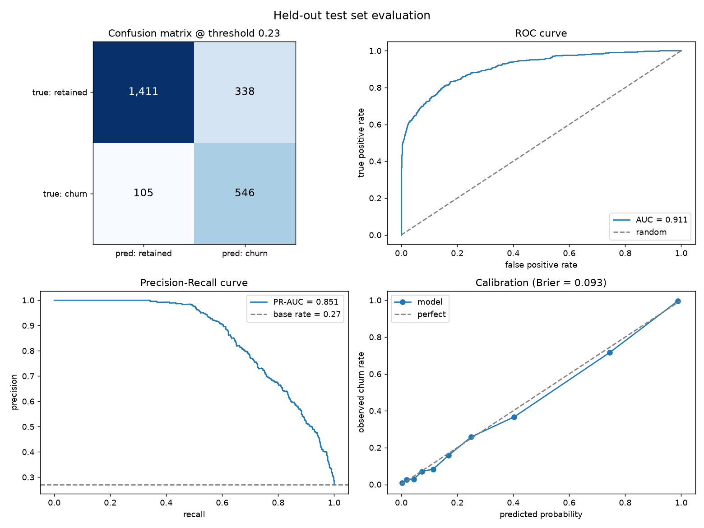

# Customer Churn Prediction

An end-to-end churn solution for an e-commerce business: synthetic data generation, EDA, a
leakage-safe training pipeline, model comparison with a cost-based decision threshold, explainability,
a FastAPI prediction service, tests, and a production architecture.

**Headline result:** logistic regression, test-set **PR-AUC 0.851 / ROC-AUC 0.911**, **84% recall**
at **62% precision**, **3.7x lift** in the top decile — against an incumbent recency rule at
PR-AUC 0.795 and a majority baseline that scores 72.9% accuracy while catching nobody.

---

## Quick start

```bash
git clone <repository-url>
cd churn-prediction

python3 -m venv .venv
source .venv/bin/activate          # Windows: .venv\Scripts\activate
pip install -r requirements.txt

python -m src.data_generation      # writes data/customers_raw.csv    (~2s)
python -m src.eda                  # writes reports/eda_report.md     (~5s)
python -m src.train                # writes artifacts/ + reports/     (~30s)
python -m pytest                   # 59 tests                         (~2s)

uvicorn src.api:app --reload --port 8000
```

Then open <http://localhost:8000/docs> for interactive API docs, or:

```bash
curl -X POST http://localhost:8000/predict \
  -H "Content-Type: application/json" \
  -d '{"tenure_months": 14, "orders": 8, "average_order_value": 72.50,
       "days_since_last_order": 63, "support_tickets": 4}'
```

```json
{
  "churn_probability": 0.1836,
  "prediction": "medium_risk",
  "will_churn": false,
  "decision_threshold": 0.23,
  "top_reasons": [
    {
      "feature": "orders_last_90d",
      "label": "Orders in the last 90 days",
      "direction": "increases_risk",
      "contribution": 0.3587
    },
    {
      "feature": "order_value_cv",
      "label": "Order-value consistency",
      "direction": "decreases_risk",
      "contribution": -0.3367
    },
    {
      "feature": "orders_per_month",
      "label": "Order frequency",
      "direction": "increases_risk",
      "contribution": 0.3299
    }
  ],
  "imputed_fields": [
    "age",
    "orders_last_90d",
    "..."
  ],
  "model_version": "logistic_regression@2026-08-04T...",
  "customer_id": null
}
```

`make install && make all` does data → EDA → train → test in one step.

---

## Repository layout

```
src/
  config.py            paths, churn definition, split policy, cost assumptions, feature contract
  data_generation.py   behavioural simulation + deliberate data-quality defects
  data_prep.py         RowCleaner + FeatureEngineer (sklearn transformers) and dataset prep
  features.py          pipeline assembly: clean -> engineer -> impute/scale/encode -> model
  models.py            4 candidates and their search spaces
  train.py             split -> tune -> select -> threshold -> test -> persist
  evaluate.py          metrics, cost-based threshold search, evaluation plots
  explain.py           permutation importance, odds ratios, SHAP, per-customer reasons
  eda.py               reproducible EDA report
  schemas.py           pydantic request/response contracts
  api.py               FastAPI service
tests/                 59 tests across data prep, generation, pipeline, metrics and API
notebooks/             01_churn_analysis.ipynb - executed narrative walkthrough
docs/                  architecture.md + architecture.png (+ the script that renders it)
reports/               eda_report.md, evaluation.json, model_leaderboard.csv, plots
artifacts/             churn_model.joblib, model_metadata.json
```

---

## 1. Data and assumptions

### Churn definition

> **A customer is churned if they place no order in the 90 days following the snapshot date
> (2026-01-01).**

E-commerce customers do not cancel; they just stop coming back, so absence of purchase is the only
observable signal. The definition is forward-looking — features come from before the snapshot, the
label from after it — which makes label leakage structurally impossible.

Its weakness is honest and worth stating: a customer who genuinely buys twice a year is labelled
"churned" at every snapshot. That is why `recency_vs_habit` (silence relative to that customer's
*own* cadence) is engineered rather than relying on raw recency.

### Why the data is simulated rather than assembled

Inventing feature columns and then defining the label as a rule over them
(`churn = days_since_last_order > 60`) produces a circular dataset where any model scores near
1.0 and nothing is demonstrated. Instead `src/data_generation.py` simulates behaviour:

1. Each customer has a latent purchase rate and a latent **dormancy time**, drawn from a hazard
   model driven by support friction, discount dependence, return rate, tier and channel.
2. Orders are a Poisson process, active only until dormancy.
3. Features are read from orders **before** the snapshot; the label from orders **after** it.

12,000 customers, **27% churn rate**. Recency is strongly predictive but not deterministic, which
is why the achievable ROC-AUC ceiling here sits near 0.91 rather than 0.99.

### Data-quality defects (deliberately injected, all handled)

| Defect | Scale | Handling |
|---|---|---|
| Duplicate customer rows (export re-run) | 300 rows | De-duplicated **before** splitting, so no customer spans train and test |
| Missing age | 7% | Median imputation **+ a missingness indicator** (age is missing non-randomly) |
| Impossible ages (0, 3, 129, 214) | 25 rows | Set to NaN, then imputed — never silently clipped |
| `-1` sentinel for "never ordered" | 463 rows | → NaN plus an explicit `never_ordered` flag |
| Order value exported in cents | 37 rows | Values above 1500 divided by 100 |
| NULL where 0 was meant (support tickets) | 374 rows | Imputed, indicator retained |
| Country as `UK` / `uk` / `GB` / `United Kingdom ` | 13 raw spellings → 7 countries | Canonicalised in `RowCleaner` |
| Mixed-case subscription tier | 8% | Lower-cased and trimmed |
| **Leaky column** `subscription_cancelled_at_export` | corr 0.72 with target | **Dropped** (see §4) |

The `-1` sentinel is the most dangerous of these: numerically it reads as *the most recent buyer in
the dataset*, so leaving it in teaches the model that never-ordering customers are the safest.

Full profile: [`reports/eda_report.md`](reports/eda_report.md).

---

## 2. Feature engineering

Raw counts are confounded by tenure — 10 orders means something different for a 2-month-old account
than for a 3-year-old one. Every engineered feature normalises a count by the exposure that produced
it, or compares recent behaviour against that customer's own baseline.

| Feature | Definition | Rationale |
|---|---|---|
| `recency_vs_habit` | recency ÷ expected order gap | **The key feature.** 40 days of silence is alarming for a weekly buyer, normal for a twice-a-year buyer |
| `orders_per_month` | orders ÷ tenure | Purchase intensity, free of tenure confounding |
| `expected_order_gap_days` | tenure days ÷ orders | The customer's personal rhythm |
| `recent_order_share` | orders in 90d ÷ lifetime orders | Accelerating or fading |
| `support_tickets_per_order` | tickets ÷ orders | Friction per unit of value delivered |
| `return_rate` | returns ÷ orders | Dissatisfaction proxy |
| `order_value_cv` | order-value std ÷ mean | Erratic vs habitual spending |
| `estimated_lifetime_value` | orders × AOV | What is at stake if they leave |

One feature was **tried and removed**: `log_days_since_last_order` was collinear with raw recency,
changed CV PR-AUC by 0.0004, and took a negative coefficient that made "days since last order" read
as *risk-reducing* in the explanation table. A feature that buys no accuracy and costs
interpretability is a net loss.

---

## 3. Models

| Candidate | CV PR-AUC | CV ROC-AUC | Role |
|---|---|---|---|
| Majority class | 0.271 | 0.500 | Sanity floor: 72.9% accuracy, catches zero churners |
| Recency rule (`> N days`) | 0.776 | 0.860 | The incumbent business heuristic — the real bar to beat |
| **Logistic regression** (selected) | **0.839** | **0.901** | Interpretable, calibrated, fast |
| Gradient boosting (HistGB) | 0.841 | 0.901 | Non-linearities and interactions |

### Why logistic regression was selected over gradient boosting

Gradient boosting wins by **0.0018 PR-AUC against a fold standard deviation of 0.013**. That is
noise, not a difference. The **one-standard-error rule** in `train.select_model` therefore takes the
simplest model statistically tied with the best, which buys:

- coefficients readable directly as odds ratios;
- exact per-customer explanations with no SHAP dependency at serving time;
- sub-millisecond inference and a small artefact;
- fewer ways to fail silently on retraining.

This is a tie-breaker, not a blanket preference for simplicity: had the booster won by ~0.03 PR-AUC
it would have been selected, and
`tests/test_pipeline.py::test_one_standard_error_rule_still_picks_a_clearly_better_model` pins that.

**Trade-offs.** Logistic regression cannot express interactions (high support volume mattering
*only* for low-frequency buyers) and assumes a monotone log-odds relationship. Gradient boosting
captures both but costs interpretability, needs regularisation on 12k rows, and produces less
well-calibrated probabilities without an extra calibration step. Given the near-identical scores,
those costs buy nothing here.

---

## 4. Validation and data leakage

```
raw extract
  ├── de-duplicate on customer_id, drop leaky columns
  ├── stratified 80/20 split ──────────────► TEST (2,400 rows, sealed)
  │     └── TRAIN (9,600 rows)
  │           ├── 5-fold stratified CV → hyperparameter search per candidate
  │           ├── out-of-fold predictions → model selection (PR-AUC)
  │           ├── same out-of-fold predictions → decision threshold
  │           └── refit the winning config on all of TRAIN
  └── score TEST exactly once, report
```

Four specific risks, and what was done about each:

1. **Target leakage from a future column.** `subscription_cancelled_at_export` is written when the
   CRM extract is taken — *after* the outcome window closes. `train.leakage_demonstration`
   quantifies it: keeping it lifts CV PR-AUC from 0.839 to **0.958**, a model that would look
   excellent offline and be worthless live, because the field is empty at scoring time for exactly
   the customers we care about. It is listed in `config.LEAKY_COLUMNS` and dropped.
2. **Preprocessing leakage.** Imputer medians, scaler statistics and encoder categories are fitted
   *inside each CV fold*, because every step lives in one `Pipeline`. Fitting them on the full
   dataset first is the most common silent leak in tutorial code.
   `test_preprocessing_is_fitted_inside_cross_validation_folds` asserts fold-local fitting.
3. **Duplicate rows across the split.** De-duplication happens before the split, not after.
4. **Test-set contamination through tuning.** The decision threshold is a hyperparameter like `C`,
   so it is chosen on out-of-fold predictions. The test set is touched by exactly one line of
   `train.py`, after every decision is frozen.

**Train/serve skew** is prevented structurally: all cleaning and feature engineering are sklearn
transformers *inside* the saved pipeline, so the API cannot apply a different transformation from
the one the model was fitted with. `test_row_cleaner_is_row_independent` asserts that scoring one
row alone gives the same result as scoring it in a batch.

---

## 5. Evaluation

### Why not accuracy

The majority baseline scores **72.9% accuracy while catching zero churners**. Any metric that
rewards that is the wrong metric for this problem.

### Metric priority

**Recall first, subject to a precision floor, with PR-AUC as the headline ranking metric.**

A retention offer costs ~£8; a churned customer costs ~£120 in forward margin, of which an offer
recovers ~30%. **Missing a churner is roughly 15x more expensive than bothering a loyal customer**,
so recall dominates — but not without limit: precision below ~50% means most of the campaign budget
is spent on customers who were never leaving, and repeated unnecessary discounts train customers to
wait for offers.

PR-AUC rather than ROC-AUC because we care about the ranking of the *positive* class, and ROC-AUC is
optimistic under class imbalance. **Brier score** is also tracked: the probabilities are used to
prioritise a call list, so their calibration matters, not just their order.

### Handling class imbalance: at the threshold, not in the loss

The obvious move on a 27%-positive problem is `class_weight="balanced"`. It was tried and
**rejected**, because reweighting the loss and lowering the decision threshold are two ways of
expressing the same preference, and doing both double-counts it. Measured on out-of-fold predictions:

| | PR-AUC | ROC-AUC | Brier | Mean predicted probability |
|---|---|---|---|---|
| `class_weight="balanced"` | 0.8386 | 0.9017 | 0.119 | 0.387 |
| **No class weighting** | 0.8388 | 0.9010 | **0.097** | **0.273** (base rate 0.271) |

Weighting bought nothing in ranking and pushed every predicted probability ~40% too high — the
reliability curve sat visibly below the diagonal. Without it the probabilities are honest, and the
cost asymmetry is applied once, at the threshold, where the assumptions behind it are written down
in `config.py` and can be argued about by the business.

Resampling (SMOTE) was rejected for the same reason plus a worse one: 27% positives is not extreme
enough to need synthetic minority samples, and it would distort calibration further.

### Test-set results (2,400 held-out customers, scored once)

| Metric | Majority | Recency rule | **Logistic regression** |
|---|---|---|---|
| Accuracy | 0.729 | 0.814 | 0.815 |
| Precision | 0.000 | 0.628 | 0.618 |
| Recall | 0.000 | 0.771 | **0.839** |
| F1 | 0.000 | 0.692 | **0.711** |
| ROC-AUC | 0.500 | 0.874 | **0.911** |
| PR-AUC | 0.271 | 0.795 | **0.851** |
| Brier | 0.198 | 0.148 | **0.093** |
| Lift @ top 10% | 1.04x | 3.59x | **3.67x** |
| Expected cost / customer | £32.55 | £27.68 | **£27.31** |

Note that **accuracy is essentially identical to the recency rule (0.815 vs 0.814) while every
metric that matters is clearly better** — a clean illustration of why accuracy was not the
selection metric.

### Confusion matrix at the chosen threshold (0.23)

|  | Predicted retained | Predicted churn |
|---|---|---|
| **Actually retained** | 1,411 | 338 |
| **Actually churned** | 105 | **546** |

Of 651 real churners we catch 546 (84%). Of 884 customers flagged, 546 really churn (62%).

### The threshold is a business decision

0.5 is an arbitrary default. `evaluate.choose_threshold` sweeps the threshold on out-of-fold
validation predictions and minimises expected cost, landing at **0.23** — well below 0.5, exactly as
the 15:1 cost asymmetry implies. Changing the cost assumptions in `config.py` moves the threshold without
touching the model.

### Honest comparison against the incumbent

Against the recency rule, the model catches **44 more churners** (546 vs 502) for **41 more false
alarms** (338 vs 297) — about **£0.38 per customer per quarter**, or ~£45k a year on a
30,000-customer base. Real, but not spectacular, and worth saying plainly: most of the signal in
churn is recency. The model's contribution is the part recency misses — customers whose *personal*
cadence has broken while their absolute recency still looks fine.



---

## 6. Explainability

Permutation importance on held-out data, in units of PR-AUC lost when a column is shuffled
(computed on **raw input columns**, so each row is something the business can act on):

| Feature | PR-AUC lost when shuffled |
|---|---|
| Days since last order | 0.452 |
| Lifetime orders | 0.137 |
| Orders in the last 90 days | 0.088 |
| Account tenure | 0.069 |
| Lifetime returns | 0.009 |

Coefficients as odds ratios — features are standardised, so each is the effect of a
**one-standard-deviation** change, not one unit:

| Driver | Odds ratio | Direction |
|---|---|---|
| Silence relative to own buying rhythm | 3.27 | ▲ risk |
| Typical gap between orders | 2.43 | ▲ risk |
| Days since last order | 1.95 | ▲ risk |
| Orders in the last 90 days | 0.31 | ▼ risk |
| Order frequency | 0.53 | ▼ risk |

`/predict` returns the top drivers per customer, so a retention agent gets a reason to open a
conversation rather than a bare score.

### For a non-technical stakeholder

> **The model mostly measures one thing: has this customer gone quiet relative to their own normal
> pattern?** A customer silent for longer than their usual gap between orders is the clearest
> warning sign; recent orders are the clearest reassurance. Support tickets and returns push risk
> up, but weakly — they are a symptom, not the main story.
>
> **What it can do:** out of every 100 customers it flags, about 62 would really have churned, and
> it catches roughly 84 of every 100 churners. Treat it as a prioritised call list, not a verdict on
> any individual.
>
> **What it cannot do:** it has never seen a retention campaign. Once we act on its output, our own
> interventions change the outcomes it is later measured against, and its apparent accuracy will
> fall. Keeping a small untreated control group is what lets us keep measuring honestly.

---

## 7. Prediction API

| Endpoint | Method | Purpose |
|---|---|---|
| `/predict` | POST | Score one customer, with per-customer reasons |
| `/predict/batch` | POST | Score up to 5,000 customers (no explanations — the expensive part) |
| `/health` | GET | Liveness/readiness; reports whether the model loaded |
| `/model-info` | GET | Full training metadata: params, threshold, feature contract, library versions |
| `/docs` | GET | OpenAPI UI |

Design decisions:

- **Only `tenure_months` and `orders` are mandatory.** The brief's five-field example works exactly
  as written; every other field improves the estimate but is imputed if absent, and the response
  lists `imputed_fields` so callers can see how much of a score rests on defaults.
- **The threshold and risk bands come from the model metadata**, not from a constant in the API, so
  retraining can move the operating point without an API deployment.
- **Validation before the model.** Pydantic rejects negative counts, out-of-range proportions and
  unknown fields with a 422 and a field-level message, rather than producing a confident nonsense
  prediction.
- **503, not 500, when no model is loaded** — an un-trained deployment fails loudly and correctly.
- **Unknown categories degrade gracefully**: a new country encodes to an all-zero block instead of
  raising.

---

## 8. Tests

```bash
python -m pytest              # 59 tests, ~2s
python -m pytest -v           # named, readable as a specification
```

| File | Covers |
|---|---|
| `test_data_prep.py` | Every injected defect, row-independence of cleaning (train/serve skew guard), no infinities from ratio features, leaky-column removal |
| `test_data_generation.py` | Reproducibility by seed, churn rate in range, **label is not a deterministic function of recency**, internal consistency of counts |
| `test_pipeline.py` | No NaN reaches the estimator, beats the baseline, unseen categories, missing fields, monotone risk in recency, **fold-local preprocessing**, the 1-SE selection rule in both directions |
| `test_evaluate.py` | Metrics against a hand-computed confusion matrix, cost asymmetry, threshold optimality, lift |
| `test_api.py` | The brief's exact payload, schema, risk-band consistency, 422 on five invalid payloads, batch/single agreement, 503 without a model |

The suite runs against a small generated dataset and does not require a trained artefact —
`test_api.py` trains a stub if `artifacts/churn_model.joblib` is absent, so a fresh clone passes.

---

## 9. Production architecture

Full write-up with monitoring, drift, retraining and versioning:
**[`docs/architecture.md`](docs/architecture.md)**.


Summary: daily batch ELT → point-in-time feature pipeline (offline + online store) → weekly training
with an evaluation gate → model registry → nightly batch scoring plus an online FastAPI path →
CRM, BI and support desk. Monitoring covers service health, input drift (PSI), prediction drift and
realised performance.

The defining operational constraint: **a label for a customer scored today only exists in 90 days**,
so outcome monitoring lags by a quarter. Input and prediction drift are the early warning; realised
performance is the confirmation.

---

## 10. Assumptions and limitations

**Assumptions**

1. 90 days without an order is a reasonable proxy for churn in this business.
2. Cost figures (£8 per intervention, £120 per lost customer, 30% save rate) are illustrative. The
   *ratio* drives the threshold, and it is a single edit in `config.py`.
3. Customers are independent; no household or B2B account structure.
4. The 12-month feature window is long enough to characterise a customer's rhythm.

**Limitations**

1. **Synthetic data.** Real performance will differ; the methodology is what transfers.
2. **The churn proxy mislabels slow-cadence customers** — a genuine, quantifiable weakness.
3. **A single snapshot date**, so seasonality is not represented. Production should train on
   multiple snapshots with a temporal rather than random split.
4. **Predicts churn, not save-ability.** The business wants the customers an offer would *save*,
   which is an uplift-modelling problem and needs a randomised holdout first.
5. **Calibration is good** (Brier 0.093, and the reliability curve sits on the diagonal), but it was
   measured on synthetic data from a stationary process. Real data drifts, so calibration should be
   re-checked on every retrain before probabilities are quoted in a financial forecast.
6. **No fairness audit.** Age and country are inputs; before production I would check error-rate
   parity across country and tenure bands and consider dropping age entirely, since it contributes
   almost nothing.

**Next steps, in priority order**

1. Temporal validation across multiple snapshot dates.
2. A randomised untreated holdout, then uplift modelling.
3. Survival modelling ("when", not just "whether") for campaign scheduling.
4. Dockerfile + CI (lint, tests, training smoke test on every PR).
5. MLflow registry integration and automated drift monitoring.
6. Authentication and rate limiting on the API.

---

## Use of AI-assisted development tools

This submission was developed with **Claude (Anthropic) in Claude Code**, used for scaffolding
modules, drafting tests and documentation, and as a reviewer for the modelling approach. All design
decisions — the churn definition, the simulation-based data strategy, the one-standard-error
selection rule, the cost-based threshold, the leakage demonstration, and the feature set — were
directed, reviewed and verified by me, and I can discuss or modify any part of it.

Three specific cases where the first draft was rejected and changed after checking the numbers:

1. **`class_weight="balanced"` was removed.** The calibration plot showed the model systematically
   over-predicting. Measuring it confirmed the cause: weighting bought no ranking improvement and
   pushed mean predicted probability from 0.273 to 0.387 against a 0.271 base rate. Removing it
   improved Brier from 0.119 to 0.093 and moved the reliability curve onto the diagonal.
2. **`log_days_since_last_order` was dropped** after an ablation showed it added nothing (0.8391 vs
   0.8387) and took a negative coefficient that made recency read as risk-*reducing*.
3. **A per-row monotonicity test was replaced with a population-level one** after inspection showed
   individual customer curves legitimately wobble under correlated recency features.
