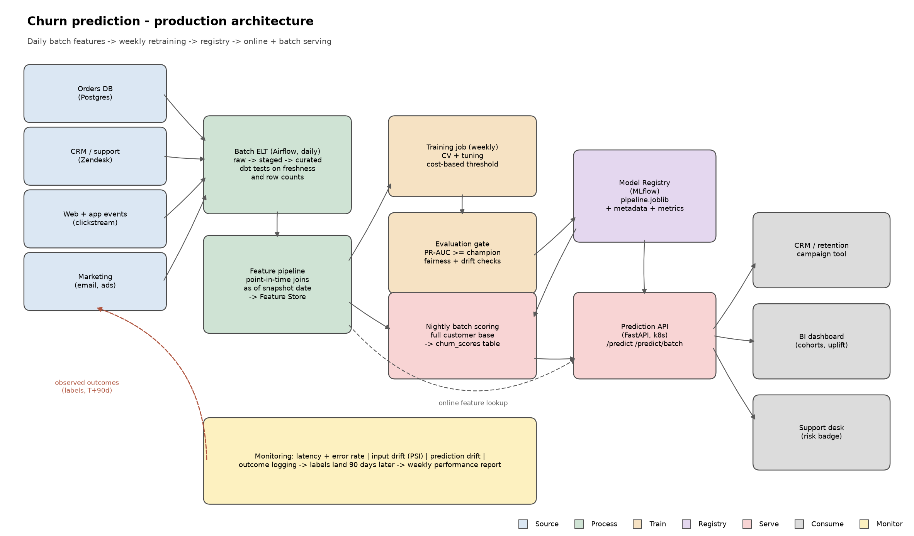
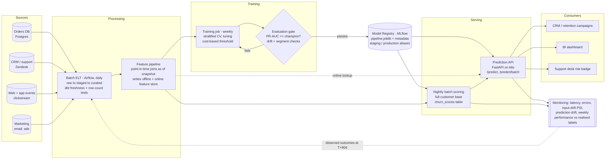

# Production architecture

*(Regenerate with `python docs/make_architecture_diagram.py`. The mermaid source below is the same
design in text form, for reviewers reading on GitHub.)*

## Component notes

**Sources.** Orders and subscriptions from the transactional database; support tickets from the
helpdesk; sessions and page views from the event stream; campaign engagement from the marketing
platform. All land in the warehouse via daily batch — churn over a 90-day horizon does not need
streaming ingestion, and batch is far cheaper to operate and reason about.

**Feature pipeline.** The one component where correctness is genuinely hard. Every feature is
computed with a **point-in-time join as of the snapshot date**: for a customer being labelled on
2026-01-01, only events strictly before that date may contribute. The offline store (training) and
the online store (serving) are written by the *same* job, so a feature cannot mean one thing in
training and another in production.

**Training.** Weekly on a rolling 24-month window. The job is `src/train.py`: split, tune each
candidate with stratified CV, select by PR-AUC under the one-standard-error rule, pick the decision
threshold on out-of-fold predictions, then score the sealed test set once.

**Evaluation gate.** A new model is promoted only if it beats the current champion on PR-AUC on a
common held-out period, keeps calibration within tolerance (Brier), and shows no material
degradation on key segments (country, subscription tier, tenure band). Otherwise the champion stays
and the run is flagged for review — automatic promotion on a single aggregate metric is how a
quietly-broken model reaches production.

**Registry.** MLflow (or equivalent). Each version stores the serialised pipeline, the training
metadata (`artifacts/model_metadata.json`: params, threshold, feature contract, library versions,
seed), the evaluation report, and a pointer to the exact data snapshot. `production` and `staging`
aliases mean rollback is an alias move, not a redeploy.

**Serving, two paths.**
- *Batch* (the main path): every customer scored nightly into `churn_scores`, which the CRM and BI
  tools read. Cheap, simple, and matched to how retention campaigns actually run.
- *Online* (`/predict`): for the support desk and the web app, where a score is needed mid-session
  after the customer's state has just changed. Same artefact, same code path.

## Monitoring

| Layer | What is watched | Signal that something is wrong |
|---|---|---|
| Service | p50/p99 latency, error rate, throughput | p99 > 200 ms; any 5xx |
| Input data | Null rate and range per feature, PSI vs the training distribution | PSI > 0.2 on any top-5 feature |
| Predictions | Mean predicted probability, share flagged high risk | Flag rate moves > 30% week on week |
| Outcome | PR-AUC, recall, precision, calibration vs realised labels | PR-AUC drops > 5% below the release value |
| Business | Realised churn in the flagged vs unflagged group; campaign uplift | Uplift not distinguishable from zero |

The label for a customer scored today only exists in 90 days, so **outcome monitoring necessarily
lags by a quarter**. That is the single most important operational constraint of this system:
input and prediction drift are the early warning, and realised performance is the confirmation.

## Drift and retraining

- **Data drift** — the input distribution moves (a new market, a changed checkout flow). Detected
  by PSI on the serving inputs against the training reference.
- **Concept drift** — the *relationship* changes (a subscription relaunch makes 60 days of silence
  normal). Only visible in realised performance, hence the quarterly lag.
- **Retraining cadence.** Scheduled weekly, plus triggered by a PSI breach or a performance alert.
  Weekly is cheap here (the full run is well under a minute) and keeps the model tracking seasonal
  shifts; the evaluation gate makes frequent retraining safe rather than risky.
- **Feedback-loop caution.** Once retention offers are sent to flagged customers, the intervention
  changes the outcome we later train on: a saved customer looks like a false positive. Left
  unhandled the model learns to under-predict exactly the customers it once saved. Mitigation: keep
  a small randomised holdout that receives no intervention, and record treatment as a feature of
  the training extract so treated and untreated customers can be modelled separately.

## Versioning

Data snapshot (immutable partition), feature definitions (versioned in the repo, breaking changes
bump a feature-set version), model (registry version + git SHA + data snapshot ID), and API
(semver; the response carries `model_version`, so a prediction can always be traced back to the
artefact that produced it).

## What I would add before this is genuinely production-ready

1. **Container + CI/CD** — Dockerfile, GitHub Actions running lint, tests and a training smoke test
   on every PR, image push on merge.
2. **A real feature store** (Feast or a curated warehouse layer) rather than features derived
   inside the pipeline, so other models can reuse them.
3. **Survival modelling.** Churn here is a binary snapshot question; "when will they churn" is more
   useful for scheduling campaigns than "will they, within 90 days". A Cox model or a discrete-time
   hazard would answer it.
4. **Uplift modelling.** The business does not want the customers most likely to churn — it wants
   the customers most likely to be *saved by an offer*. Different target, better ROI, and it needs
   the randomised holdout above to be in place first.
5. **Authentication and rate limiting** on the API, plus request/response logging to a store that
   supports later joins to outcomes.
