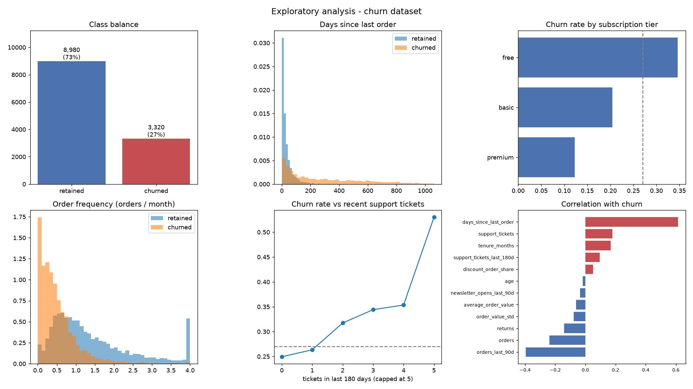

# Exploratory data analysis

- Rows: **12,300** (12,000 unique customers)
- Churn rate: **27.0%** - imbalanced but not extreme; enough positives (~3k) that resampling is unnecessary. Class weighting is sufficient.
- Churn definition: no order in the 90 days after the 2026-01-01 snapshot.

## Data-quality issues found

1. **Duplicate customer rows**: 300 repeated `customer_id` values (re-run of the export job). Fix: `drop_duplicates(subset='customer_id')` before splitting, so the same customer cannot land in both train and test.
2. **Age**: 859 missing (7.0%) and 25 impossible values (0, 3, 129, 214). Fix: impossible -> NaN, then median imputation plus a `missingindicator_age` column, because self-reported age is missing non-randomly.
3. **Sentinel values**: `days_since_last_order == -1` on 463 rows means 'never ordered', not '-1 days'. Fix: convert to NaN and add an explicit `never_ordered` flag - leaving -1 in place would tell the model these are the *most recent* buyers.
4. **Unit inconsistency**: 37 `average_order_value` rows are ~100x the rest (exported in cents). Fix: divide values above 1500 by 100.
5. **Inconsistent categories**: 13 raw `country` spellings ('UK', 'uk', 'GB', 'United Kingdom ') collapsing to ~10 real countries; `subscription_type` arrives in mixed case. Fix: canonicalise in `RowCleaner` so the one-hot encoder does not split one country across four columns.
6. **NULL vs 0 ambiguity**: 374 `support_tickets` are NULL where 0 is almost certainly meant. Fix: impute, but keep the missingness indicator rather than assuming.
7. **Leakage**: `subscription_cancelled_at_export` is written when the CRM extract is taken, i.e. *after* the outcome window closes. It is ~0.72 correlated with the label and would be empty at scoring time. Fix: listed in `config.LEAKY_COLUMNS` and dropped.

## Column profile

| column                           | dtype   |   missing_pct |   n_unique |   min |   median |       max |
|:---------------------------------|:--------|--------------:|-----------:|------:|---------:|----------:|
| customer_id                      | str     |          0    |      12000 |       |          |           |
| age                              | float64 |          6.98 |         69 |  0    |   38     |   214     |
| tenure_months                    | float64 |          0    |        350 |  1    |   18.4   |    35.9   |
| orders                           | int64   |          0    |        211 |  0    |   13     |   389     |
| orders_last_90d                  | int64   |          0    |         38 |  0    |    2     |    42     |
| average_order_value              | float64 |          3.76 |       5969 | 11.75 |   51.95  | 10152     |
| order_value_std                  | float64 |          3.76 |       3361 |  0    |   15.8   |   104.28  |
| days_since_last_order            | float64 |          0    |        845 | -1    |   24     |  1062     |
| support_tickets                  | float64 |          3.04 |         34 |  0    |    1     |    50     |
| support_tickets_last_180d        | int64   |          0    |         13 |  0    |    0     |    13     |
| returns                          | int64   |          0    |         51 |  0    |    1     |    96     |
| discount_order_share             | float64 |          3.76 |        792 |  0    |    0.264 |     0.972 |
| newsletter_opens_last_90d        | int64   |          0    |         18 |  0    |    3     |    17     |
| subscription_type                | str     |          0    |          6 |       |          |           |
| country                          | str     |          0    |         13 |       |          |           |
| acquisition_channel              | str     |          0    |          5 |       |          |           |
| primary_device                   | str     |          0    |          3 |       |          |           |
| snapshot_date                    | str     |          0    |          1 |       |          |           |
| orders_in_outcome_window         | int64   |          0    |         41 |  0    |    2     |    45     |
| churned                          | int64   |          0    |          2 |  0    |    0     |     1     |
| subscription_cancelled_at_export | int64   |          0    |          2 |  0    |    0     |     1     |

## Relationship with churn

Churn rate in the bottom vs top quintile of each numeric feature. A large spread means the feature separates the classes on its own; `point_biserial_corr` is the linear correlation with the label.

| feature                   |   churn_rate_lowest_quintile |   churn_rate_highest_quintile |   spread |   point_biserial_corr |
|:--------------------------|-----------------------------:|------------------------------:|---------:|----------------------:|
| days_since_last_order     |                        0.055 |                         0.79  |    0.735 |                 0.614 |
| orders_last_90d           |                        0.534 |                         0.02  |   -0.514 |                -0.395 |
| orders                    |                        0.483 |                         0.079 |   -0.404 |                -0.238 |
| tenure_months             |                        0.166 |                         0.365 |    0.199 |                 0.168 |
| returns                   |                        0.327 |                         0.134 |   -0.194 |                -0.142 |
| support_tickets           |                        0.221 |                         0.403 |    0.183 |                 0.179 |
| order_value_std           |                        0.322 |                         0.226 |   -0.096 |                -0.076 |
| support_tickets_last_180d |                        0.253 |                         0.347 |    0.094 |                 0.095 |
| average_order_value       |                        0.287 |                         0.209 |   -0.078 |                -0.062 |
| discount_order_share      |                        0.225 |                         0.285 |    0.059 |                 0.05  |
| newsletter_opens_last_90d |                        0.295 |                         0.242 |   -0.053 |                -0.036 |
| age                       |                        0.286 |                         0.261 |   -0.025 |                -0.017 |

## Takeaways for modelling

- **Recency dominates**, as expected, but it is not sufficient: the recency-only rule reaches PR-AUC ~0.78 against ~0.84 for the learned models. The gap is customers whose *normal* cadence is slow - they look dormant on an absolute scale and are not.
- **Counts need normalising by exposure.** Raw `orders` is confounded by tenure; `orders_per_month` and `recency_vs_habit` are the versions that generalise.
- **Support tickets and returns are weak individually** but carry signal in combination with low order frequency - an argument for keeping a non-linear candidate in the comparison.
- **No resampling and no class weighting.** 27% positives is not extreme. SMOTE and `class_weight='balanced'` both distort calibration for no measurable ranking gain (out-of-fold PR-AUC 0.8386 weighted vs 0.8388 unweighted, Brier 0.119 vs 0.097). The class imbalance is handled once, at the decision threshold, where the cost assumptions are explicit.

